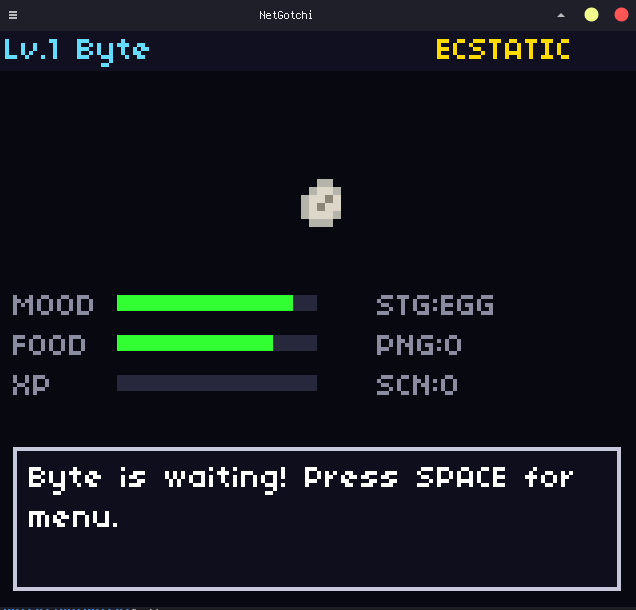
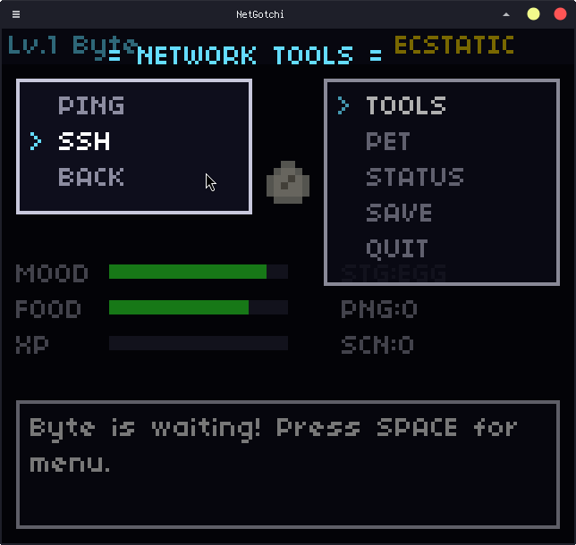
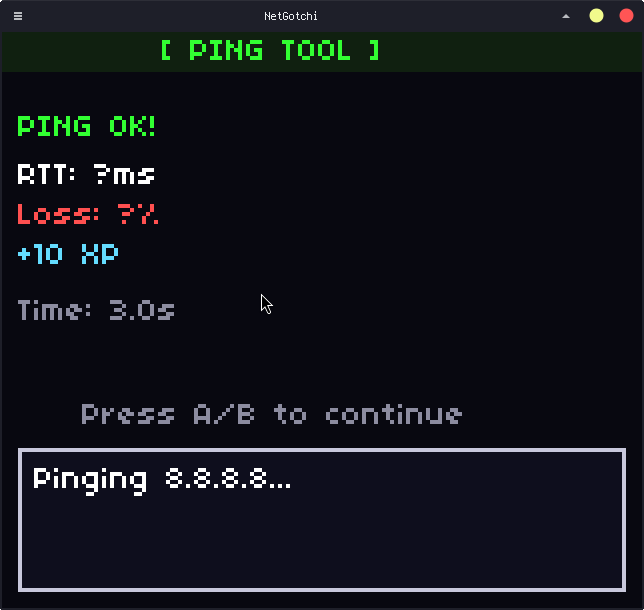

# NetGotchi

A network engineering toolkit disguised as a virtual pet game. Run real network tools — ping, SSH, nmap — and watch your pet evolve as you investigate!

Built with Python and pygame. Every module is annotated with **LEARNING NOTES** that teach Python, networking, and game development concepts as you read the code.


---

## Screenshots

| Overworld | Tools Menu | Ping Tool |
|:-:|:-:|:-:|
|  | |  |

---

## Features

- **GBC-authentic display** — 160×144 internal resolution, 4× integer-scaled to 640×576. 4-color palettes, 8×8 pixel sprites, JRPG-style dialog boxes and menus
- **Virtual pet** — Bit hatches from an egg and evolves through 5 stages (Bit → Byte → Packet → Frame → Stream) as you earn XP
- **Real network tools** — Ping hosts, SSH into devices with preset or freeform CLI commands, scan networks with nmap
- **Dynamic host discovery** — Reads `~/.ssh/config` and `/etc/hosts` so your real hosts appear in-game
- **Save system** — Pet stats persist to JSON between sessions; your pet gets hungry while you're away
- **Educational codebase** — Every file includes inline teaching comments covering Python patterns, networking fundamentals, and game architecture

## Quickstart

### 1. Clone

```bash
git clone https://github.com/d3ej/netgotchi.git
cd netgotchi
```

### 2. Create a virtual environment

```bash
python3 -m venv venv
source venv/bin/activate    # Linux / macOS
# venv\Scripts\activate     # Windows
```

### 3. Install dependencies

```bash
pip install -r requirements.txt
```

### 4. Run

```bash
python3 main.py
```

A 640×576 window opens with your pet on the overworld.

### Optional: nmap scanning

The scanner tool wraps the system `nmap` binary. Install it if you want network scanning:

```bash
# Debian / Ubuntu
sudo apt install nmap

# macOS
brew install nmap
```

---

## Controls

| Button | Keys | Action |
|--------|------|--------|
| **D-Pad** | Arrow keys / WASD | Navigate menus |
| **A** | Enter / Z | Confirm / select |
| **B** | Escape / X | Cancel / back |
| **START** | Space | Open menu |
| **SELECT** | Tab | Secondary action |

In the SSH CLI mode, type freely with your keyboard. **Enter** submits the command, **Escape** returns to the command list.

---

## Project Structure

```
netgotchi/
├── main.py                     # Entry point, game loop, all scene classes
├── requirements.txt
├── netgotchi/
│   ├── engine/
│   │   ├── renderer.py         # 160×144 GBC renderer with 4× scaling
│   │   ├── input.py            # Virtual button mapping + text input
│   │   ├── scene.py            # Stack-based scene manager
│   │   └── ui.py               # PixelFont, DialogBox, Menu, StatusBar
│   ├── pet/
│   │   ├── pet.py              # Pet stats, evolution, serialization
│   │   └── sprites.py          # 8×8 palette-indexed sprite data
│   ├── data/
│   │   ├── palettes.py         # 4-color GBC palettes
│   │   └── fonts/              # 04b03.ttf pixel font
│   ├── tools/
│   │   ├── base.py             # Threaded base tool class
│   │   ├── ping.py             # ICMP ping via subprocess
│   │   ├── ssh.py              # SSH via paramiko
│   │   ├── scanner.py          # Network scanning via python-nmap
│   │   └── hosts.py            # Host discovery from system config
│   ├── rpg/                    # RPG mechanics (planned)
│   └── save/
│       └── state.py            # JSON save/load
└── saves/
    └── netgotchi_save.json     # Auto-generated save file
```

## Pet Evolution

Your pet earns XP every time you use a network tool. As XP accumulates, it evolves:

| Stage | Name | XP Required |
|-------|------|-------------|
| Egg | Bit | 0 |
| Hatchling | Byte | 50 |
| Juvenile | Packet | 200 |
| Adult | Frame | 500 |
| Elder | Stream | 1000 |

Stats like mood, hunger, and energy decay in real time — even when the game is closed. Run tools and feed your pet scan data to keep it happy.

## Adding Tools

Each tool follows a 3-step pattern:

1. **Backend** — Create a class in `netgotchi/tools/` that extends `BaseTool` and implements `_execute(params)`
2. **Scene** — Add a scene class in `main.py` with host/command/result phases
3. **Wire it up** — Add the scene to `ToolMenuScene.TOOLS` and import it

See `ping.py` → `PingScene` for the simplest example, or `ssh.py` → `SSHScene` for one with CLI text input.

## Dependencies

| Package | Purpose |
|---------|---------|
| `pygame` | Display, input, audio |
| `paramiko` | SSH connections |
| `python-nmap` | Network scanning |
| `scapy` | Low-level packet crafting (planned) |
| `psutil` | System/network info (planned) |

## License

MIT
